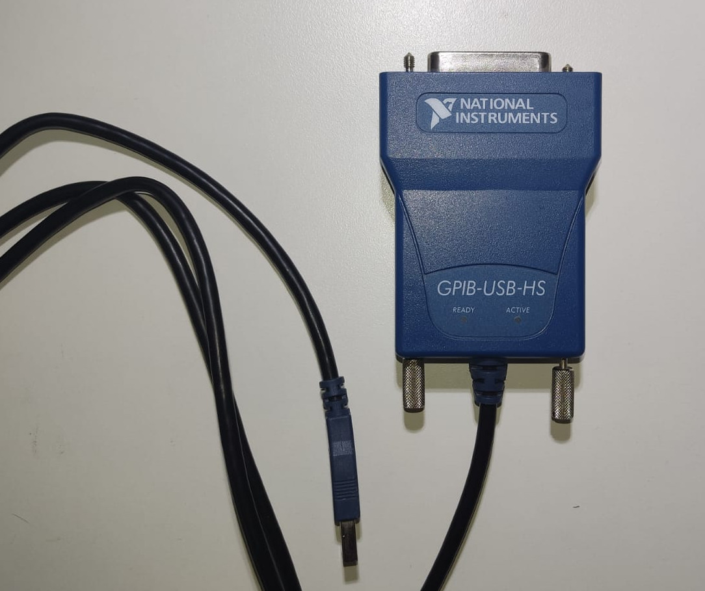
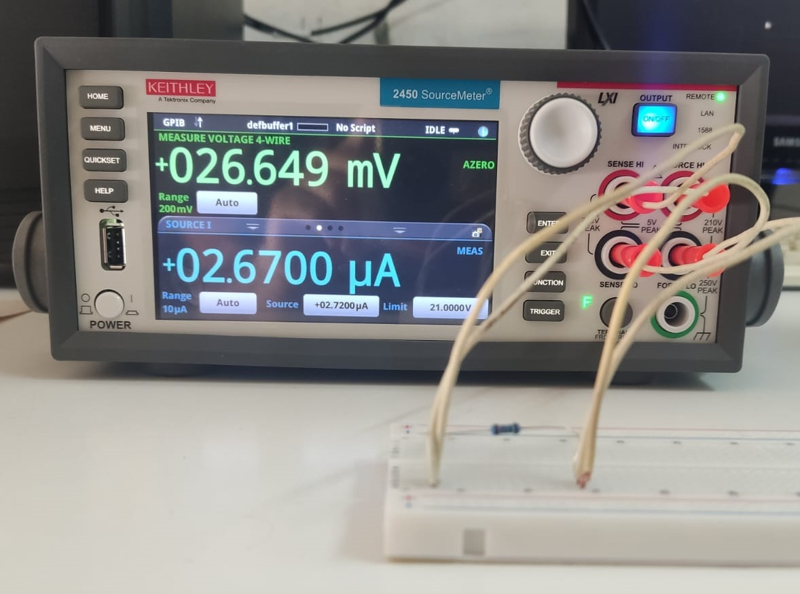

## IV Measurements

    This package enables current-voltage (source-measure) measurements using the four-point method. It employs a <a href="https://www.ni.com/en-us/shop/model/gpib-usb-hs.html?srsltid=AfmBOopwEccrcoXDp2XUzmgdSBz0NDASSDglsKWUMonApSxfc0KlcZGf">GPIB-USB-HS</a> controller device and a <a href="https://www.tek.com/en/datasheet/smu-2400-graphical-sourcemeter/model-2450-touchscreen-source-measure-unit-smu-instrument">2450 SourceMeter</a>. Figure 1 illustrates the experimental setup.

  
  

    <b>Figure 1.</b> (left) The GPIB-USB-HS controller and (right) the 2450 SourceMeter and the four-point setting.

<b>Installation</b>

* [Python 3.12.5](https://www.python.org/downloads/)
* Install dependencies: pip install -r requirements.txt
* [Jupyter Notebook](https://jupyter.org/install): pip install notebook
* [GPIB-USB-HS](https://knowledge.ni.com/KnowledgeArticleDetails?id=kA03q000000YGw4CAG&l=en-US)
* [NI-VISA](https://www.ni.com/en/support/downloads/drivers/download.ni-visa.html#409839)

    It is important to ensure that the drivers are compatible with your operating system in steps 4 and 5. Refer to the manufacturer’s guides. We used Windows 10 with version 17.0 of the driver and NI-VISA software.

## License

Copyright © 2024 Juan Camilo Zapata

    Everyone is permitted to copy and distribute this project for scientific purposes, with the appropriate citations and acknowledgments.

## Acknowledgements

* Laboratorio de Bajas Temperaturas, Centro Atómico de Bariloche, San Carlos de Bariloche, Rio Negro, Argentina.
* The CONICET CCT Patagonia Norte is acknowledged for providing financial support for the doctoral studies.